<<<<<<< HEAD
# prometheus-grafana-node
Node.js Application Monitoring with Prometheus and Grafana
=======
# Node.js Application Monitoring with Prometheus and Grafana

This documentation provides a step-by-step guide to setting up monitoring for a Node.js application using Prometheus and Grafana. The setup includes collecting application metrics, exposing them to Prometheus, and visualizing them in Grafana.

---

## 1. Prerequisites

Ensure you have the following installed on your **Ubuntu** server:

- Node.js and npm  
- Docker and Docker Compose  
- Prometheus  
- Grafana  

---
## 2. Install Node.js on Ubuntu

Run the following commands to install Node.js and npm:

```sh
curl -fsSL https://deb.nodesource.com/setup_18.x | sudo -E bash -
sudo apt install -y nodejs
node -v  # Verify Node.js installation
npm -v   # Verify npm installation
```

---

## 3. Set Up the Node.js Application

### Create a New Node.js Project

```sh
mkdir node-monitoring
cd node-monitoring
npm init -y
```

### Install Required Packages

```sh
npm install express prom-client
```

### Create the Application (`server.js`)

```js
const express = require("express");
const client = require("prom-client");

const app = express();
const PORT = 4000;

// Create a Registry and define some metrics
const register = new client.Registry();
client.collectDefaultMetrics({ register });

const httpRequestCounter = new client.Counter({
  name: "http_requests_total",
  help: "Total number of HTTP requests",
  labelNames: ["method", "route"],
});

register.registerMetric(httpRequestCounter);

app.use((req, res, next) => {
  httpRequestCounter.inc({ method: req.method, route: req.path });
  next();
});

app.get("/", (req, res) => {
  res.send("Hello, Node.js with Prometheus!");
});

app.get("/metrics", async (req, res) => {
  res.set("Content-Type", register.contentType);
  res.end(await register.metrics());
});

app.listen(PORT, () => {
  console.log(`Server running on http://localhost:${PORT}`);
});
```
---

## 4. Create a Docker Setup

### Create a `Dockerfile`

```dockerfile
FROM node:18
WORKDIR /app
COPY package.json package-lock.json ./
RUN npm install
COPY . .
EXPOSE 4000
CMD ["node", "server.js"]
```

### Create a `docker-compose.yml`

```yaml
version: '3'
services:
  node_app:
    build: .
    ports:
      - "4000:4000"
    networks:
      - monitoring
    restart: always

  prometheus:
    image: prom/prometheus
    volumes:
      - ./prometheus.yml:/etc/prometheus/prometheus.yml
    ports:
      - "9090:9090"
    command:
      - '--config.file=/etc/prometheus/prometheus.yml'
    networks:
      - monitoring
    restart: unless-stopped

  grafana:
    image: grafana/grafana:latest
    container_name: grafana
    restart: always
    volumes:
      - grafana-data:/var/lib/grafana
    ports:
      - "3000:3000"
    environment:
      - GF_SECURITY_ADMIN_USER=admin
      - GF_SECURITY_ADMIN_PASSWORD=admin
    networks:
      - monitoring
```

---

## 5. Configure Prometheus

Create a `prometheus.yml` file:

```yaml
global:
  scrape_interval: 5s

scrape_configs:
  - job_name: "node_app"
    static_configs:
      - targets: ["node_app:4000"]

  - job_name: "prometheus"
    static_configs:
      - targets: ["prometheus:9090"]

  - job_name: "node_exporter"
    static_configs:
      - targets: ["node_exporter:9100"]
```
---

## 6. Run the Application

```sh
docker-compose up -d
```
---

## Step 7: Set Up Grafana for Visualization

### 1. Access Grafana

Open your browser and go to:

➡️ [http://localhost:3000](http://localhost:3000) (or server IP: `http://your-server-ip:3000`)
---
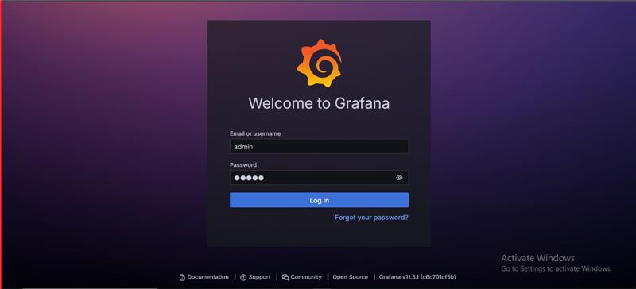
---
**Default credentials:**

- **Username:** `admin`
- **Password:** `admin` (change upon first login)

---
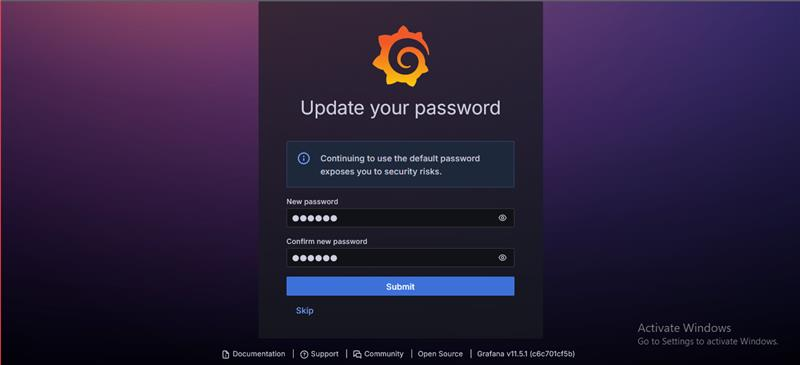
---

### 2. Add Prometheus as a Data Source

1. Go to **Configuration → Data Sources**
---
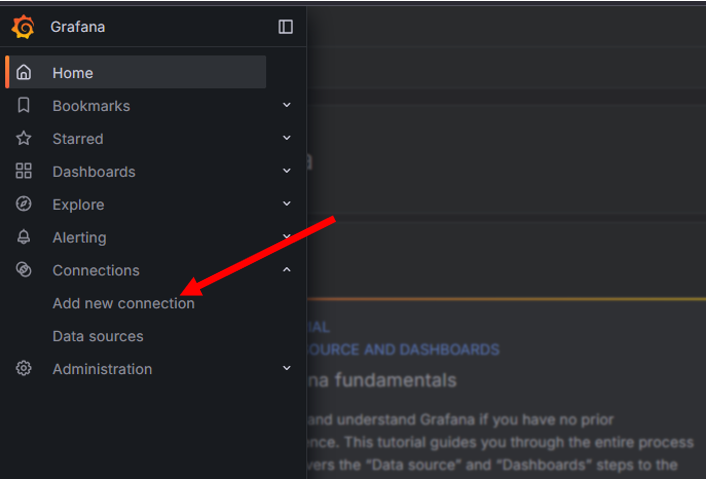
---
2. Click **"Add data source"**
---
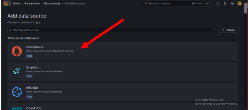
---
3. Select **Prometheus**
4. Go to Prometheus Settings and set local Prometheus URL
---
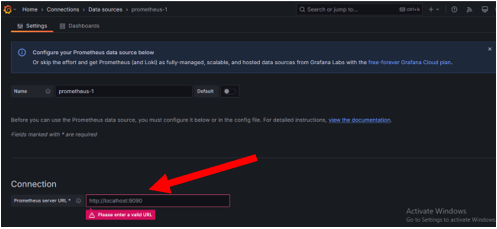
---
6. Set the URL to:

```plaintext
http://prometheus:9090
```
---
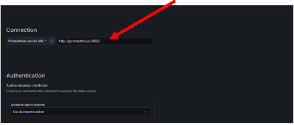
---
5. Click **"Save & Test"**
---
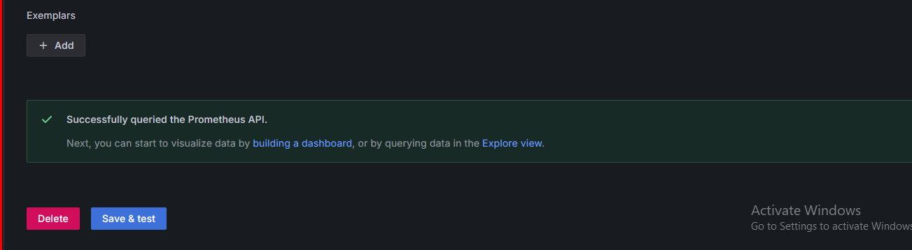
---
### 3. Create a Dashboard

1. Go to **Dashboards → New Dashboard**
---
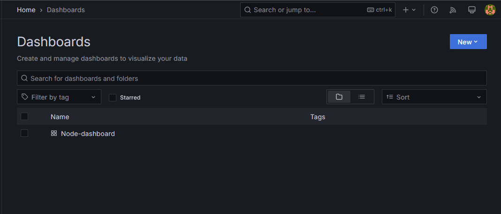
---
2. Click **"Add visualization"**
---
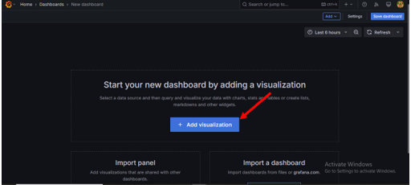
---
3. In the Query section, select **Prometheus** as the data source
---
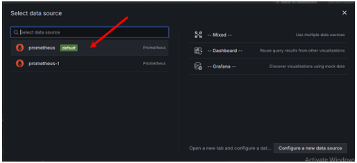
---
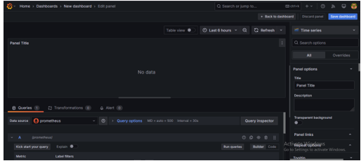
---
4. Use PromQL queries like:

```PromQL
http_requests_total
```
---
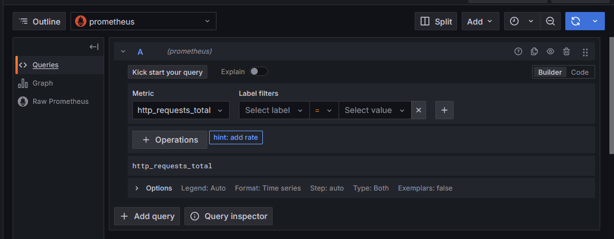
---

5. Click **Apply** and save the dashboard

---

## Step 4: Verify and Monitor Metrics

- Visit **Prometheus UI**: [http://localhost:9090](http://localhost:9090)
---
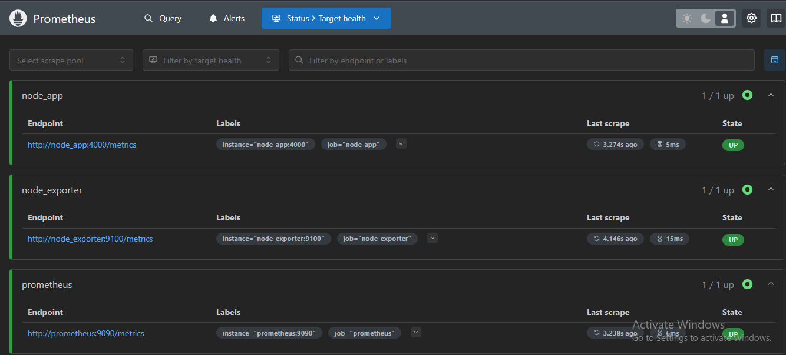
---
- Query Django metrics, e.g., `python_gc_objects_collected_total`
---
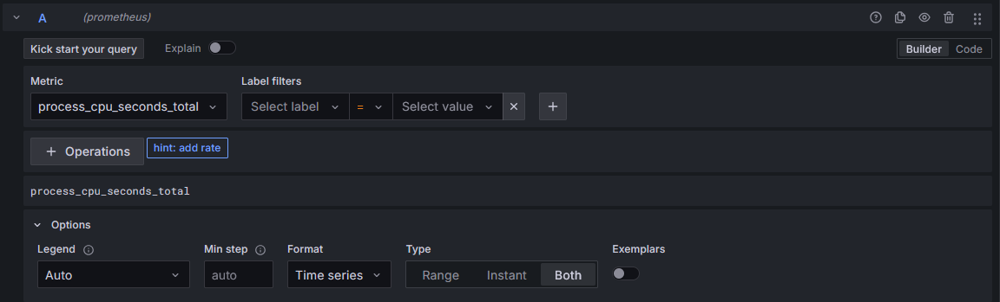
---
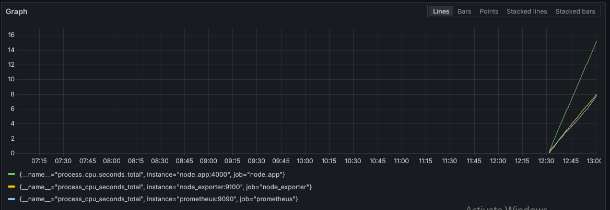
---
- Check **Grafana dashboard** for visualized metrics
---
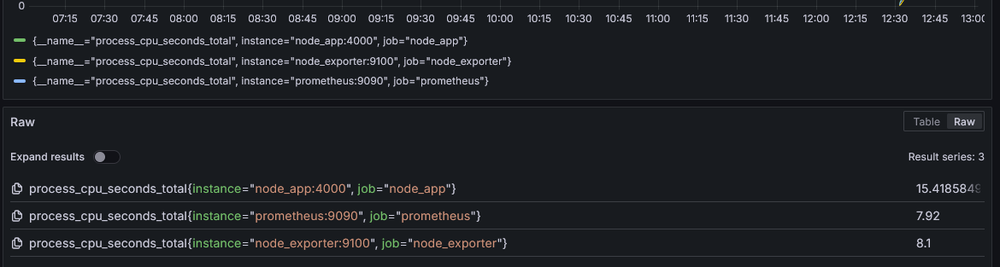
---
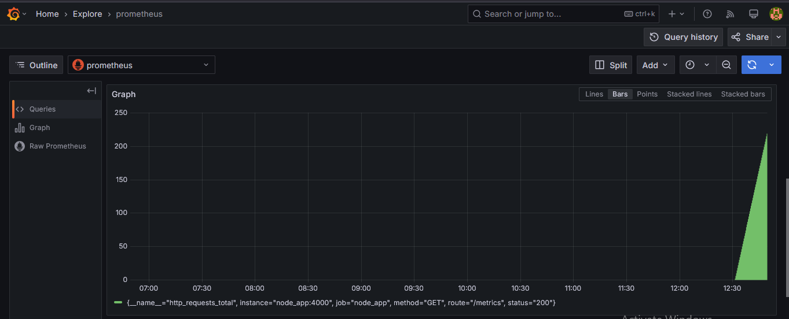
---

## 9. Verify Monitoring

- Visit `http://<your-server-ip>:4000` to check the Node.js app  
- Visit `http://<your-server-ip>:9090` to see Prometheus  
- Visit `http://<your-server-ip>:3000` to view Grafana  

---

### 🎉 **Your Node.js app is now being monitored with Prometheus and Grafana!**  

## Conclusion

You have successfully set up monitoring for your node application using Prometheus and Grafana. You can now:

✅ Track Node performance metrics  
✅ Visualize data in Grafana dashboards  

For advanced monitoring, consider adding **Alertmanager** and custom **PromQL queries**! 🚀🔥
```
>>>>>>> 366365c (Adding node js)
